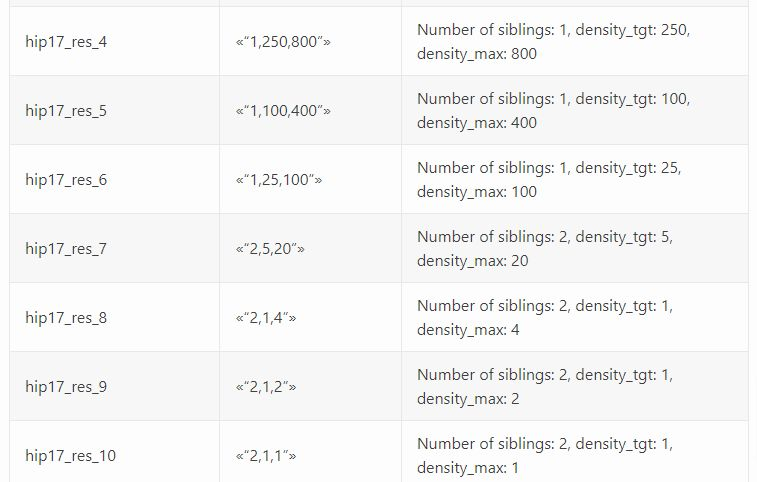
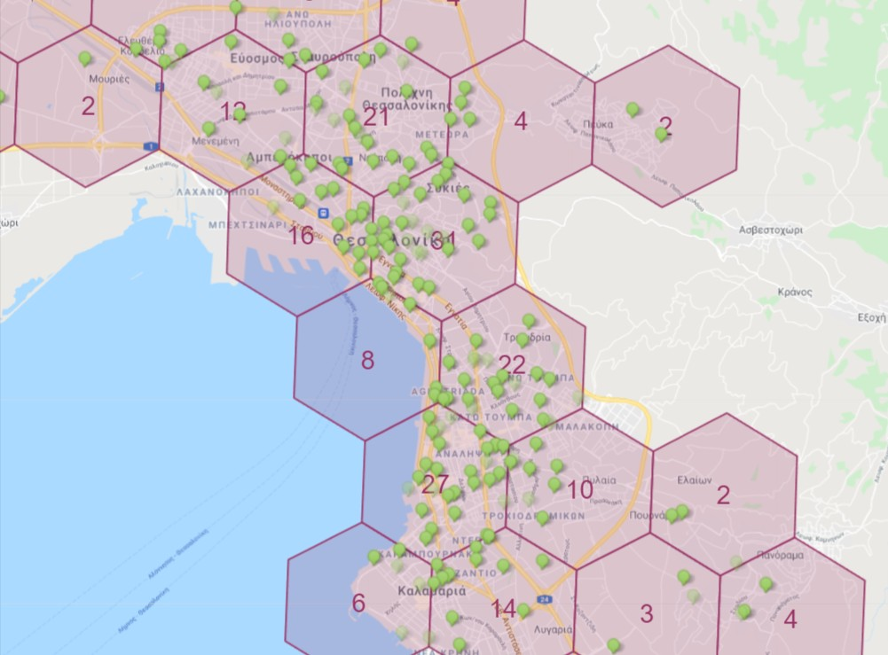
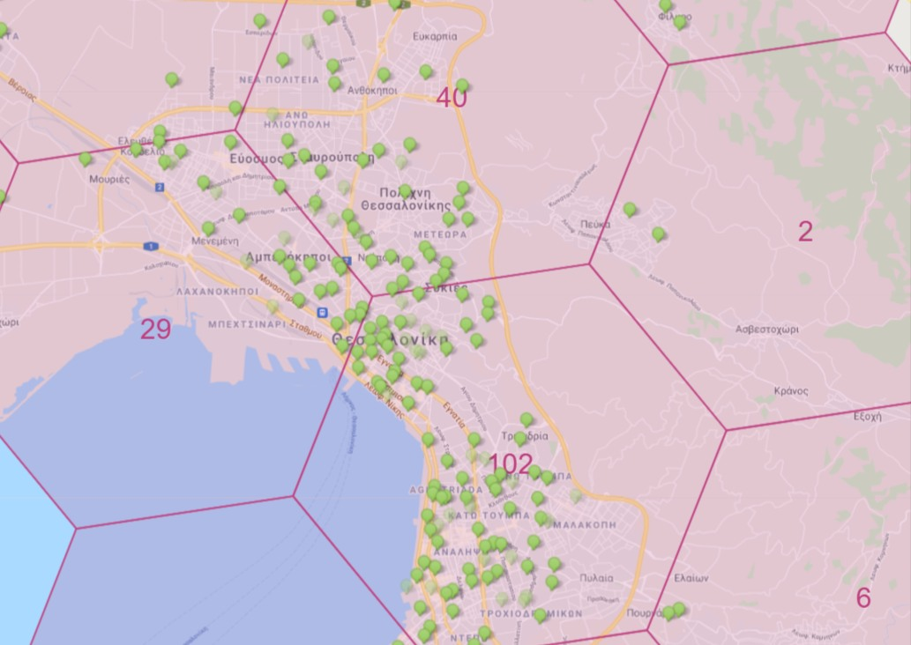

# Reward scale explained

Καλησπέρα σε όλα τα μέλη της ομάδας. Νομίζω ότι ήρθε η στιγμή να αναφερθούμε ακόμη μια φορά σε ένα θέμα σημαντικό για τη σωστή ανάπτυξη του δικτύου και κατά συνέπεια και για τα rewards των hotspots.

Aναφέρομαι στο reward scale ή transmit scale όπως ονομάστηκε στην πορεία. Πρόκειται για έναν αλγόριθμό, έναν σύνολο κανόνων που ορίζουν τα επιτρεπτά όρια πυκνότητας hotspots σε μια περιοχή. Βασίζεται σε ένα σύστημα διαχωρισμού της επιφάνειας της γης σε εξάγωνα, διαφορετικής ανάλυσης (μεγέθους). Στον helium exlporer βλέπετε τα εξάγωνα ανάλυσης resolution8 (res8) , αλλά υπάρχουν μεγαλύτερα και μικρότερα από αυτό.

Οι κανόνες αυτοί περιγράφονται στον παρακάτω πίνακα:

Τι μας λέει ο πίνακας αυτός; Τα όρια του density target και density max στο εξάγωνο της κάθε ανάλυσης. Με απλά λόγια:

Σε ένα εξάγωνο res8, όπως αυτά που βλέπουμε στον helium explorer, μπορούμε να βάλουμε 1 hotspot (density_tgt=1). Σε περίπτωση που 2 γειτονικά εξάγωνα (siblings) έχουν πιάσει τον ίδιο στόχο (δηλαδή να έχουν από 1 hs), τότε αυτό το όριο αυξάνεται σταδιακά έως το density max=4.

Συμπέρασμα; Σε κάθε εξάγωνο res8 μπορούν να μπουν το πολύ 4 hotpots, υπό προϋποθέσεις. Σε περίπτωση ύπαρξης παραπάνω από 4, το reward scale όλων μειώνεται. Αντίστοιχα σε κάθε εξάγωνο res7 μπορούν να μπουν έως 20 hotspots και σε κάθε res6 έως 100.

## Πως επηρεάζει το reward scale τις αμοιβές μας

Το δικό μας reward scale δεν επηρεάζει άμεσα τις δικές μας αμοιβές, αλλά το πόσα κερδίζουν τα άλλα hotspot που συνδέονται με το δικό μας.

Προσοχή όμως! Η μείωση του reward scale σε μια περιοχή, θα μειώσει τις αμοιβές όλων των hotspots σε αυτή την περιοχή, εφόσον το ένα θα επηρεάζει το άλλο.  

Το νόημα αυτού του συνόλου κανόνων είναι η ανάπτυξη του δικτύου όσο πιο ευρύτερα γίνεται, ώστε να επιτευχθεί κάλυψη σε περισσότερες περιοχές, αντί για συγκέντρωση υπεράριθμων hotspot σε μια πόλη.  
Τα rewards προκύπτουν επειδή το hotspot μας παρέχει κάλυψη για το δίκτυο (proof of coverage).  
Οι απαιτήσεις του δικτύου θέλουν η κάλυψη αυτή να είναι ευρεία, χρήσιμη και μοναδική. Δεν θέλουμε 10 hotspots στο ίδιο οικοδομικό τετράγωνο, γιατί στην ουσία επικαλύπτονται, μη προσφέροντας χρήσιμη και μοναδική κάλυψη στο δίκτυο.

## Τι πρέπει να κάνω

Ελέγχω το reward scale μιας περιοχής, πριν εγκαταστήσω το hotspot μου. Αυτό μπορεί να γίνει με διάφορα tools όπως to [kudzu](http://analytics.kudzu.gr/).

Προσπαθώ να κατανοήσω ότι το reward scale δεν εξαρτάται μόνο από το εξάγωνο που βλέπω στον helium explorer (res8), αλλά και από τα μεγαλύτερης ανάλυσης εξάγωνα στα οποία ανήκει η περιοχή μου. Αυτός είναι ο λόγος που μπορεί να είμαι μόνος σε ένα εξάγωνο, αλλά να έχω μειωμένο reward scale.

Επιλέγω μια τοποθεσία με όσο το δυνατόν καλύτερο reward scale (1,00).

Αποφεύγω περιοχές που έχουν ήδη πολλά hotspots και πολύ χαμηλό reward scale.

Αναζητώ εναλλακτικές τοποθεσίες, σε σπίτια φίλων η γνωστών, περιφερειακά των μεγάλων πόλεων και των περιοχών που έχουν ήδη πολλά.  

Mοιράζομαι την γνώση αυτή με φίλους, γνωστούς και άλλα μέλη της κοινότητας, ώστε να συμβάλλω στην σωστή ανάπτυξη του δικτύου.  

## Παραδείγματα

Ακολουθούν παραδείγματα από την κατάσταση που επικρατεί σήμερα στην πόλη της Θεσσαλονίκης.  

Εξάγωνα res7 με όριο 20 hotspots.  

Σε καθένα από τα εξάγωνα res7 που βλέπετε στο χάρτη της Θεσσαλονίκης, το όριο είναι 20 hotspots, ήδη αρκετά είναι υπεράριθμα.  

Eξάγωνα res6 με όριο 100 hotspots  

Στα μεγαλύτερα εξάγωνα res6, παρατηρούμε ότι αυτό που καταλαμβάνει την κεντρική και ανατολική Θεσσαλονίκη είναι ήδη υπεράριθμο.  

ΜΗΝ ΒΑΖΕΤΕ ΑΛΛΑ HOTSPOTS ΣΕ ΕΞΑΓΩΝΑ ΠΟΥ ΕΧΟΥΝ ΗΔΗ ΠΙΑΣΕΙ ΤΟ ΜΕΓΙΣΤΟ ΟΡΙΟ! MEIΩΝΕΤΕ ΤΟ REWARD SCALE, ΜΕΙΩΝΕΤΑΙ ΤΑ REWARDS TΩΝ ΑΛΛΩΝ ΜΑΖΙ ΜΕ ΤΑ ΔΙΚΑ ΣΑΣ

*Το άρθρο ανέβηκε αρχικά στο Helium Greece Discord #general_chat απο το χρήστη @Kostas_SKG στις 18 Νοεμβρίου 2021.*
