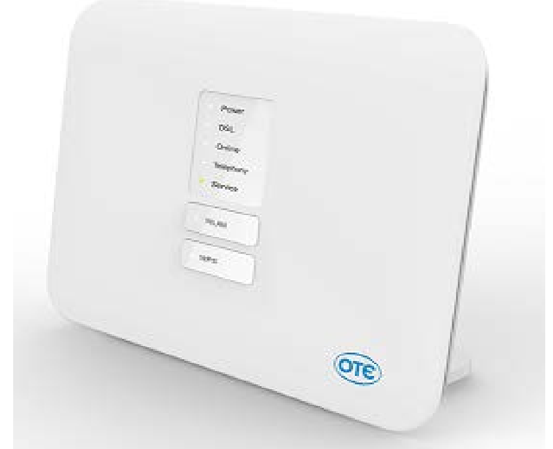
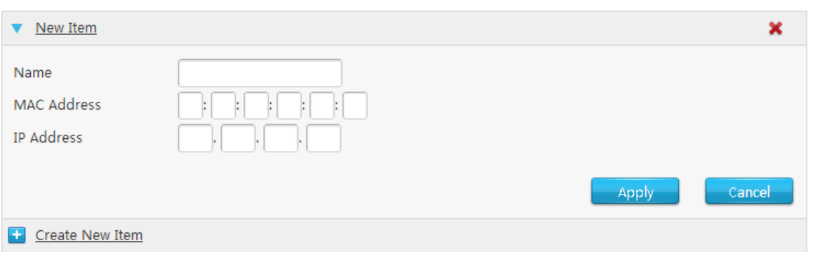
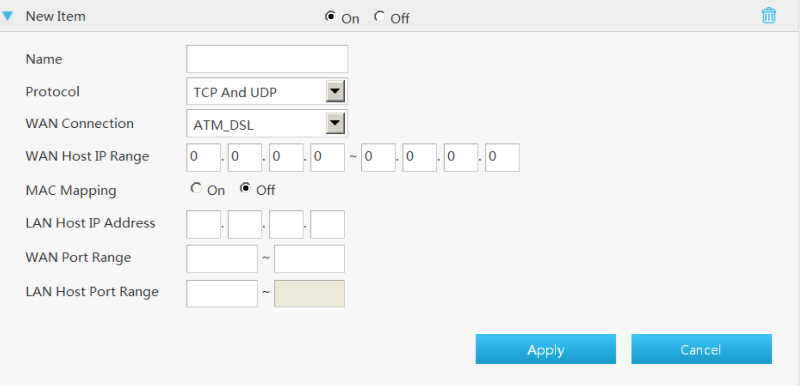

# Port Forwarding for Helium Miner σε Cosmote Speedport Entry 2i

[Back to Software Port Forwarding](../readme.md)

## Login

Στην ετικέτα στο κάτω μέρος της συσκευής, είναι γραμμένα μία IP, ένα username και ένα password για να συνδεθείς στην admin console του router σου.

Από ένα browser, γράψε http:// και συνεχόμενα την IP. Αν η IP είναι 192.168.1.1 τότε η σελίδα είναι http://192.168.1.1 και κάνε login.

## Οδηγίες για LAN Reserve IP (DHCP Binding)

- Κάνε κλίκ στο Local Network (Τοπικό Δίκτυο)
- Κάνε κλίκ στο LAN
- Κάνε κλίκ στο IPv4
- Κάνε κλίκ στο DHCP Binding. Ανοίγει μία φόρμα όπως φαίνεται στην εικόνα.
- Γράψε ένα όνομα. Προτείνεται: Helium Hotspot
- Γράψε το MAC Address του Miner
- Γράψε την IP του miner
- Κάνε κλίκ στο Apply

##  Οδηγίες για Port Forward

- Κάνε κλίκ στο Internet(Διαδίκτυο)
- Κάνε κλίκ στο Security(Ασφάλεια)
- Κάνε κλίκ στο Port forwarding (Προώθηση θυρών). Ανοίγει μία φόρμα όπως φαίνεται στην εικόνα.
- Επίλέξε το On
- Βάλε κάποιο όνομα στο Name. Προτείνεται το "Helium Hotspot"
- Επίλεξε protocol: TCP
- WAN Port Range: 44158 εως 44158
- LANHost IP Address: η IP του miner στο εσωτερικό δίκτυο
- LAN Host Port Range: 44158
- Κάνε κλίκ στο Save

> Μετά την αποθήκευση, η εγγραφή θα εμφανιστεί σε πινακάκι κάτω από τη φόρμα, οπότε αν κάνεις αλλαγές, σιγουρεψε ότι δεν έχεις κάνει διπλοεγγραφή. Μπορείς εύκολα να επεξεργαστείς ή να διαγράψεις υπάρχουσες εγγραφές.

[Back to Software Port Forwarding](../readme.md)

## Useful Links

- [Cosmote SpeedPort Entry 2i User Manual](https://help.cosmote.gr/system/templates/selfservice/gnosisgr/Files2/SPEEDPORT_ENTRY_2i_ΟΔΗΓΟΣ_ΔΙΑΧΕΙΡΙΣΗΣ_GR.pdf)
