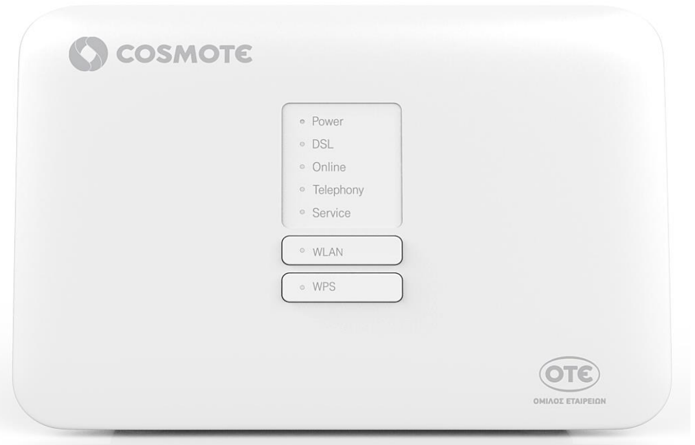
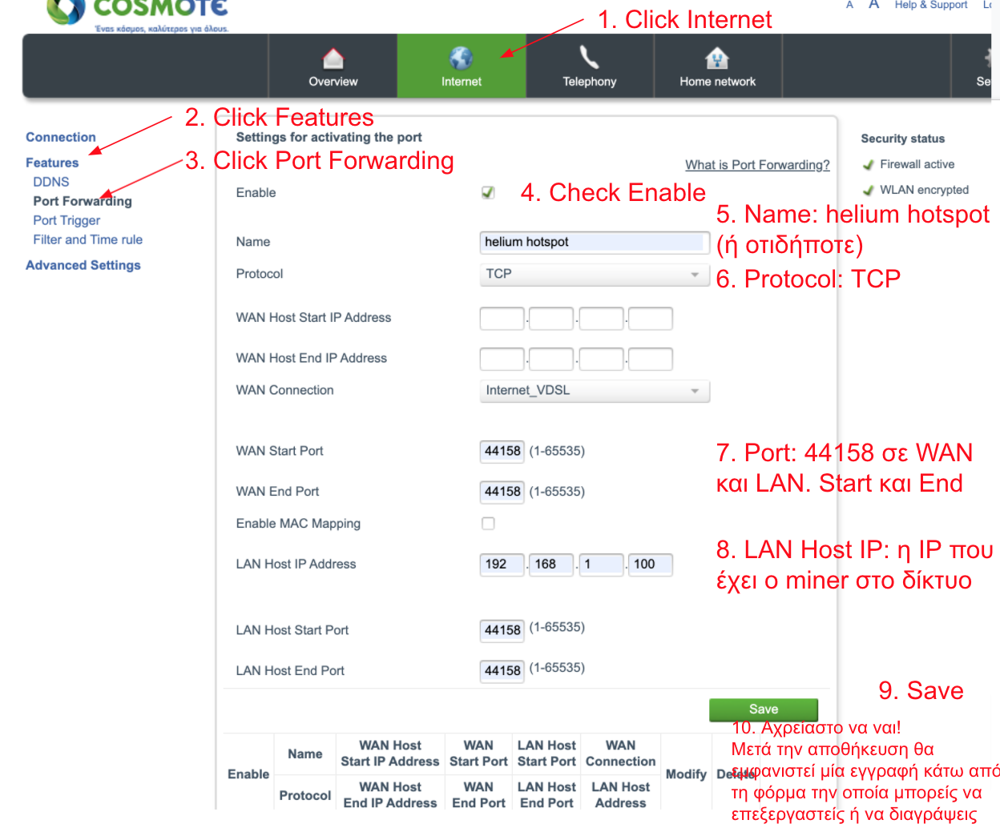
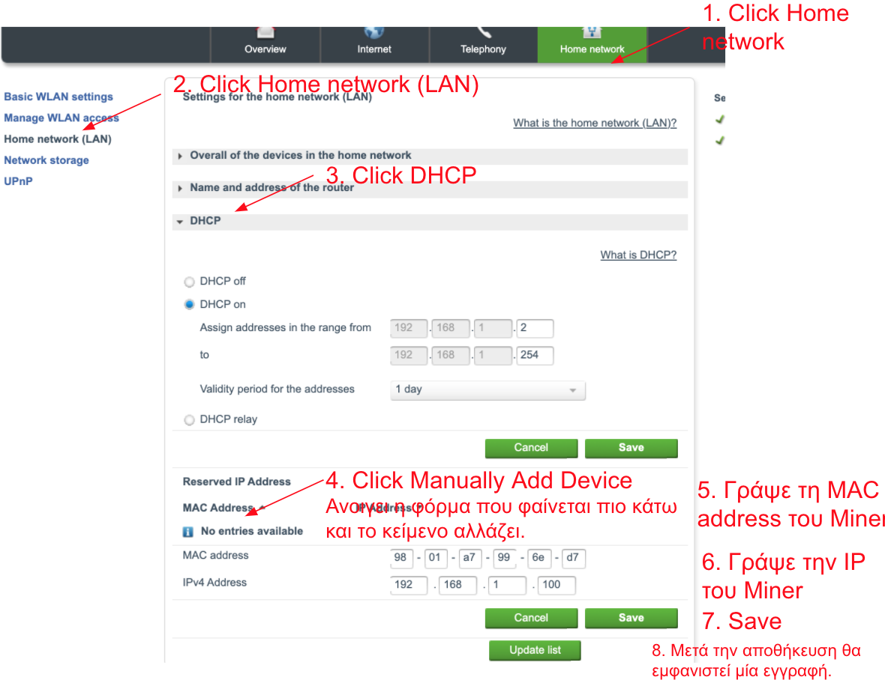

# Port Forwarding for Helium Miner σε Cosmote Speedport Plus

[Back to Software Port Forwarding](../readme.md)

## Login

Πάνω στο router είναι γραμμένα μία IP, ένα username και ένα password για να συνδεθείς στην admin console του router σου.
Από ένα browser, γράψε http:// και συνεχόμενα την IP. Αν η IP είναι 192.168.1.1 τότε η σελίδα είναι http://192.168.1.1 και κάνε login.

##  Οδηγίες για Port Forward

- Κάνε κλίκ στο Internet
- Κάνε κλίκ στο Features
- Κάνε κλίκ στο Port forwarding. Ανοίγει μία φόρμα
- Κάνε check στο Enable
- Βάλε κάποιο όνομα στο Name. Προτείνεται το "Helium Hotspot"
- Επέλεξε protocol: TCP
- WAN Start Port: 44158
- WAN End Port: 44158
- LAN Host IP Address: η IP του miner στο εσωτερικό δίκτυο
- LAN Host Start Port: 44158
- LAN Host End Port: 44158
- Κάνε κλίκ στο Save

> Μετά την αποθήκευση, η εγγραφή θα εμφανιστεί σε πινακάκι κάτω από τη φόρμα, οπότε αν κάνεις αλλαγές, σιγουρεψε ότι δεν έχεις κάνει διπλοεγγραφή. Μπορείς εύκολα να επεξεργαστείς ή να διαγράψεις υπάρχουσες εγγραφές.

[Back to Software Port Forwarding](../readme.md)

## Οδηγίες για LAN Reserve IP

- Κάνε κλίκ στο Home network
- Κάνε κλίκ στο Home network (LAN)
- Κάνε κλίκ στο DHCP. Ανοίγει μία φόρμα. Και το DHCP είναι on.
- Στο reserved IP Address, κάνε κλίκ στο manually add device
- Γράψε το MAC Address του Miner
- Γράψε την IP του miner
- Κάνε κλίκ στο Save

## Useful Links

- [Cosmote SpeedPort Plus User Manual](https://help.cosmote.gr/system/templates/selfservice/gnosis/files3/Speedport_Plus_User_Manual_eng.pdf)
